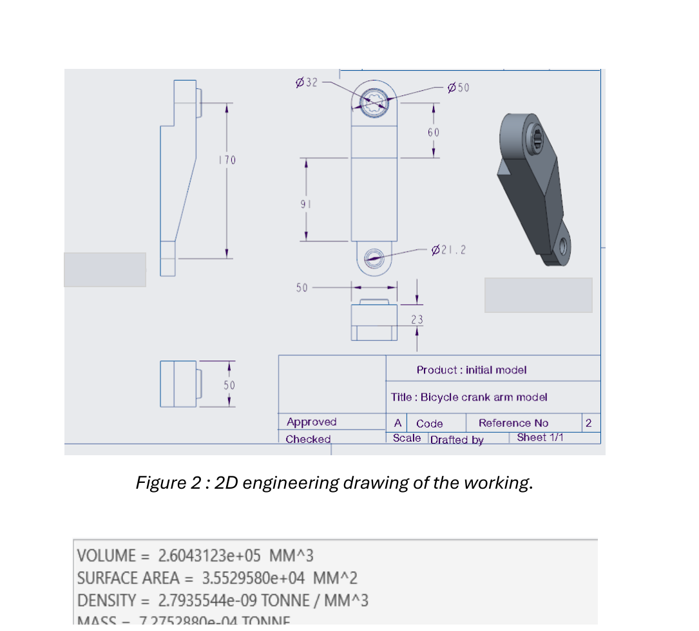
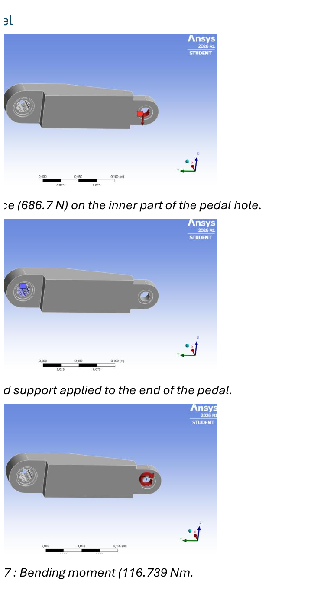
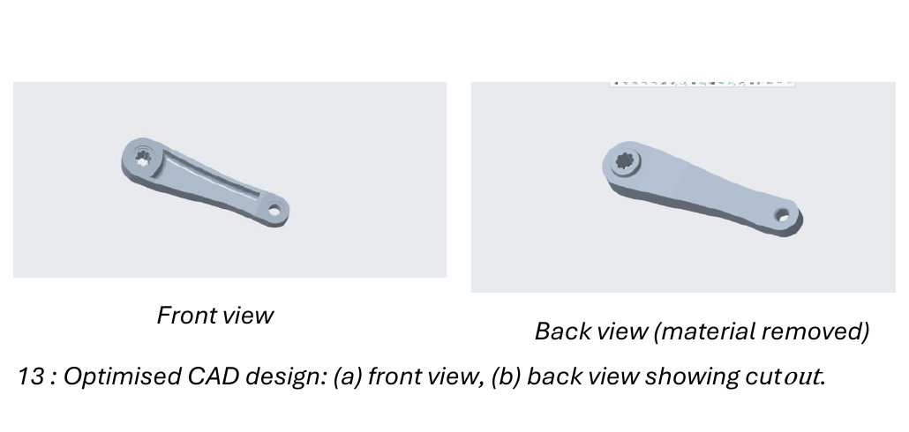
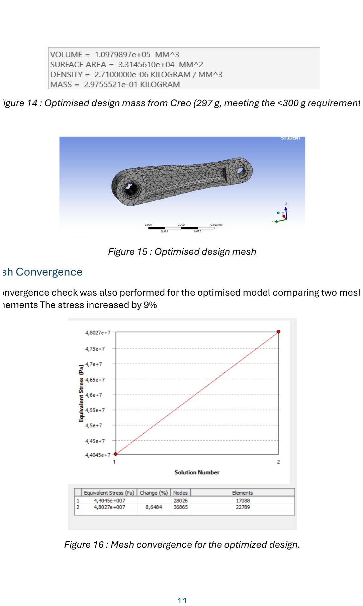
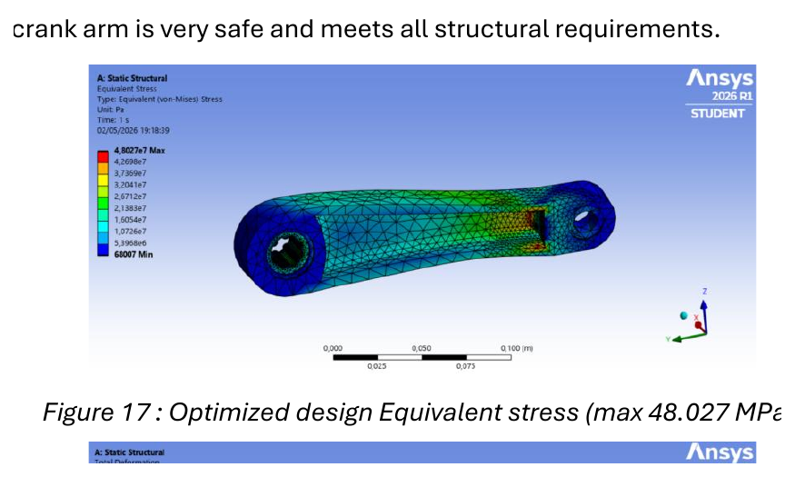
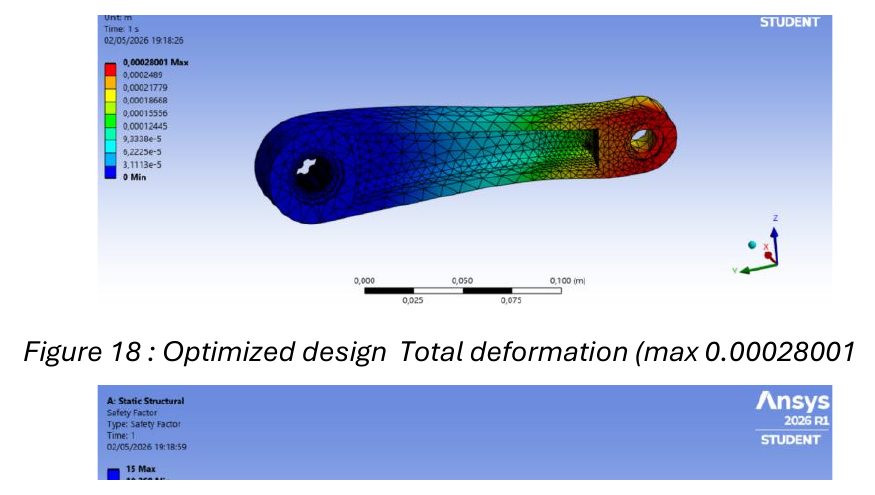
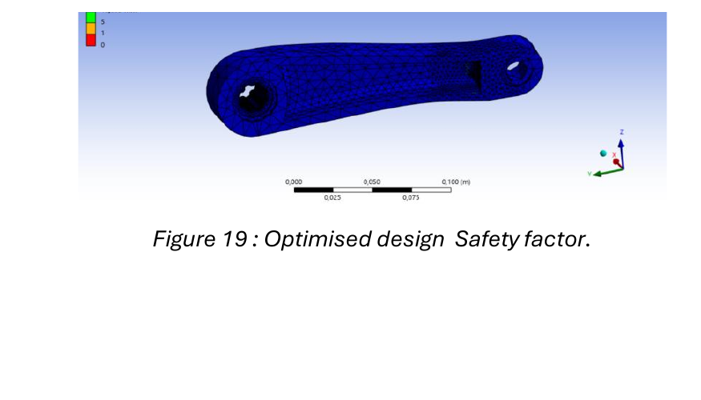
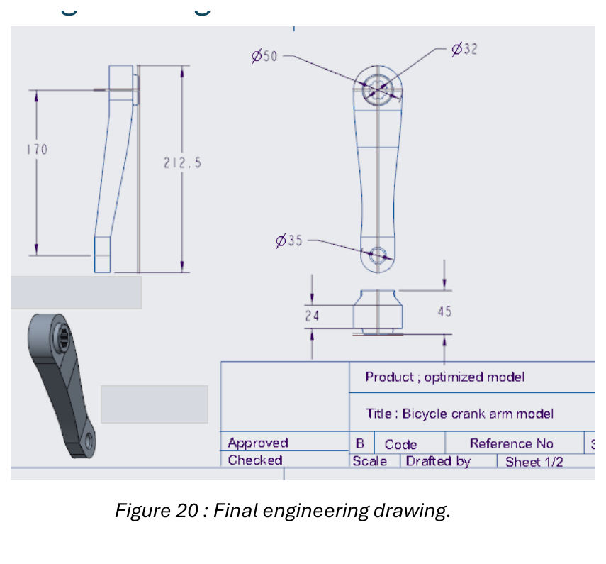

# Bicycle Crank Design and FEA Optimisation

A CAD and finite element analysis project focused on reducing the mass of a bicycle crank arm while maintaining structural safety. The crank was redesigned in Creo Parametric and evaluated in ANSYS Mechanical under a static rider load.

## Project summary

The initial crank model had a mass of **727 g**. Material was removed from lower stress regions while preserving the pedal and bottom bracket interfaces. The optimised design reached **297 g** meeting the target of less than 300 g while retaining a calculated minimum factor of safety of **10.37**.

| Metric | Baseline design | Optimised design |
|---|---:|---:|
| Mass | 727 g | 297 g |
| Mass reduction | - | 59.1% |
| Maximum von Mises stress | 35.992 MPa | 48.027 MPa |
| Maximum total deformation | 0.089 mm | 0.280 mm |
| Minimum factor of safety | 13.84 | 10.37 |

## Engineering objective

The design was required to:

- Support a 70 kg rider under the defined static loading case
- Have a mass below 300 g
- Maintain a minimum factor of safety of 2
- Preserve the original mounting interfaces and design envelope
- Use a strong, corrosion resistant and recyclable material
- Avoid sharp external features and remain suitable for manufacture

## Software and methods

- **Creo Parametric:** CAD modelling, mass property evaluation and engineering drawing
- **ANSYS Mechanical:** Static structural analysis, meshing and result evaluation
- **Finite element analysis:** Equivalent stress, total deformation and safety factor
- **Engineering calculations:** Applied force, bending moment and allowable stress
- **Design optimisation:** Material removal based on structural response and packaging constraints

## Material selection

The crank was modelled using **Aluminium Alloy 7075** because of its high strength and weight ratio, corrosion resistance and recyclability.

| Property | Value |
|---|---:|
| Density | 2800 kg/m³ |
| Young's modulus | 73.05 GPa |
| Poisson's ratio | 0.33 |
| Yield strength | 498 MPa |
| Fatigue strength at 10⁷ cycles | 147 MPa |

## Loading case
Full calculations are available in [`calculations/engineering-calculations.md`](calculations/engineering-calculations.md).

## Design development

### Initial geometry

The baseline model satisfied the required interface geometry but had a mass of 727 g exceeding the 300 g target.

### Applied loading and constraints

The project applied the calculated pedal load and represented the mounting conditions in ANSYS.

### Optimised geometry

The optimised crank retained the mounting regions while introducing a thinner web and central material removal on the rear face the resulting mass was 297 g.

## Finite element results

### Mesh and convergence

Mesh refinement was used to check the sensitivity of the reported stress result.
The optimised model's stress increased by approximately 9% between the two recorded refinement stages.

### Equivalent stress

The optimised model produced a maximum equivalent stress of 48.027 MPa well below the 249 MPa allowable stress used for the design requirement.

### Total deformation

The maximum total deformation was 0.280 mm under the defined static loading case.

### Factor of safety

The calculated minimum factor of safety was 10.37 exceeding the required value of 2.

## Final engineering drawing

## Outcome

The redesign reduced the crank mass by approximately 59.1% from 727 g to 297 g.

## Author

**Muhammed Billal Noor**

- Email: [billytoothpunch@gmail.com](mailto:billytoothpunch@gmail.com)
- LinkedIn: [linkedin.com/in/billalnoor](https://www.linkedin.com/in/billalnoor/)
