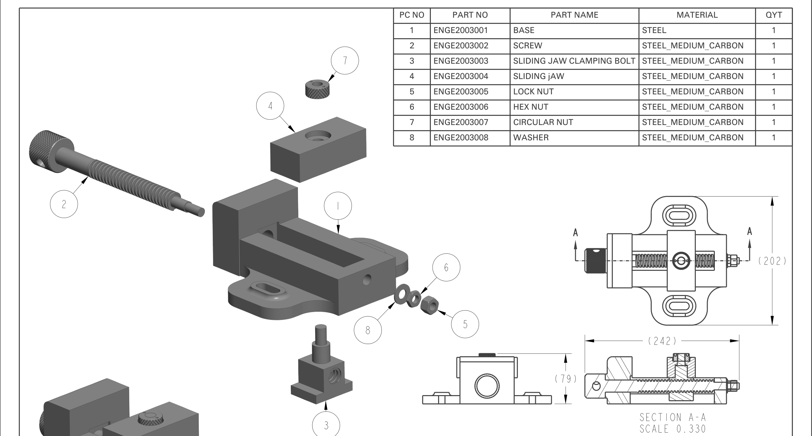
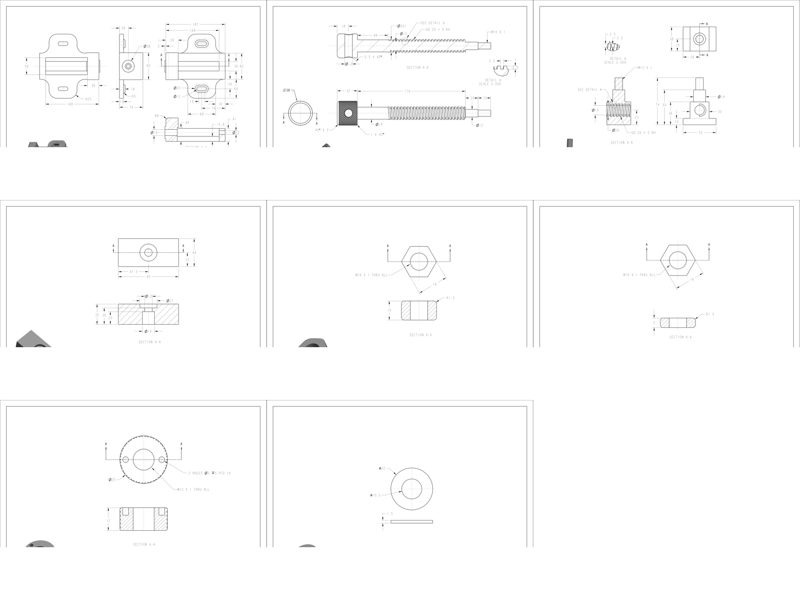
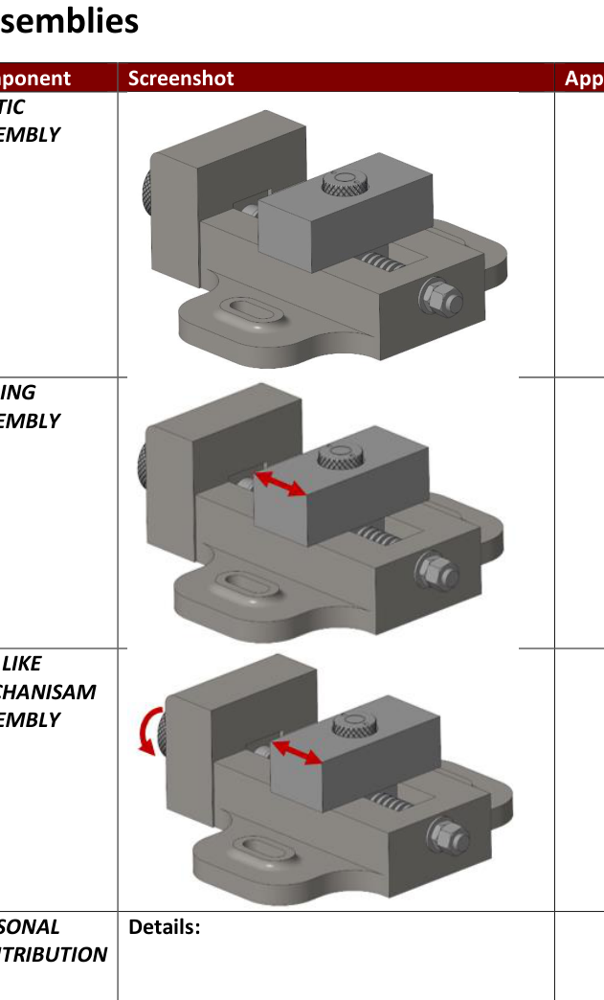

# Bench Vice CAD Design



A personal mechanical engineering portfolio project by **Billal Noor**, demonstrating parametric part modelling, detailed engineering drawings, assembly constraints and functional mechanism development using **PTC Creo Parametric**.

## Project Overview

This project develops a complete mechanical bench vice from individual components through to a functional assembly. The design includes a cast-style base, sliding jaw, lead screw, clamping bolt, threaded fasteners and retaining components.

The repository is structured so the project can be reviewed visually before opening the native CAD files.

## Final Assembly

The assembly drawing includes an exploded view, bill of materials, orthographic views and a sectional view through the screw mechanism.

## Component Modelling



The modelled component set includes:

- Base
- Lead screw
- Sliding-jaw clamping bolt
- Sliding jaw
- Lock nut
- Hex nut
- Circular retaining nut
- Washer

## Functional Mechanism



The assembly was configured to demonstrate:

- Static assembled condition
- Linear movement of the sliding jaw
- Screw-driven opening and closing behaviour
- Correct mechanical relationships between the screw, jaw and retaining hardware

## Engineering Drawings

The cleaned drawing package is available here:

[`report/Bench_Vice_Engineering_Drawings.pdf`](report/Bench_Vice_Engineering_Drawings.pdf)

| Drawing | Description |
|---|---|
| VICE-ASM-001 | Bench vice assembly |
| VICE-001 | Base |
| VICE-002 | Lead screw |
| VICE-003 | Sliding-jaw clamping bolt |
| VICE-004 | Sliding jaw |
| VICE-005 | Lock nut |
| VICE-006 | Hex nut |
| VICE-007 | Circular nut |
| VICE-008 | Washer |

## Skills Demonstrated

- Parametric solid modelling
- Feature-order planning
- Thread and fastener representation
- Assembly constraints and mechanism movement
- Section views and detailed drawings
- Exploded assembly communication
- Bill of materials preparation
- Dimensioning and tolerancing
- Mechanical design documentation

## Repository Structure

```text
cad/       Add the native Creo part, assembly and drawing files here
images/    Portfolio previews and cleaned drawing sheets
report/    Clean engineering drawing package
docs/      CAD file and project notes
```

## Opening the CAD Files

Place all native Creo `.prt`, `.asm` and `.drw` files inside the `cad` folder while retaining their original filenames. Include every referenced component so that the top-level assembly resolves without missing dependencies.

## Author

**Billal Noor**
