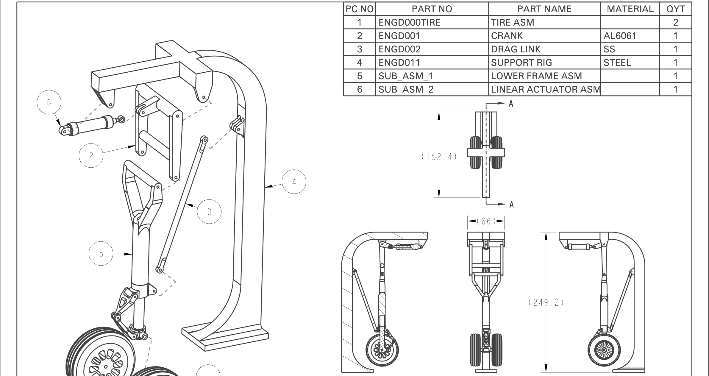
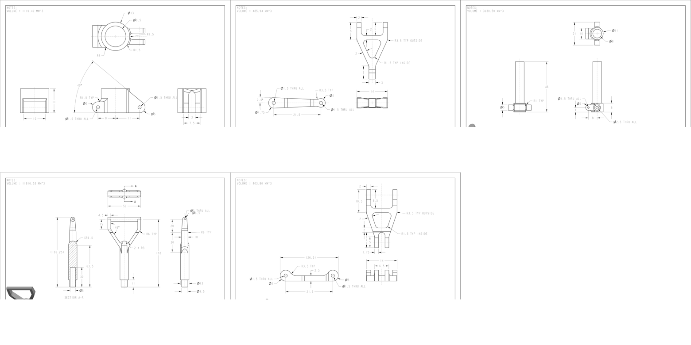
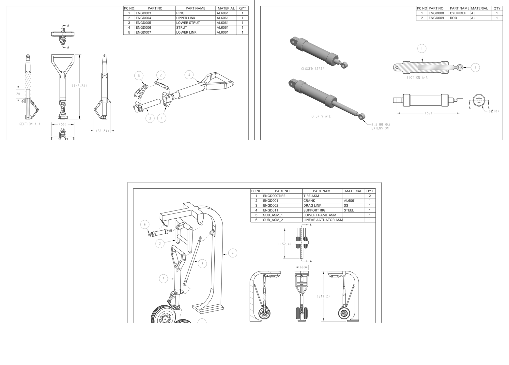

# Aircraft Landing Gear CAD Design



My mechanical engineering project for parametric component modelling, mechanical assemblies, mechanism integration and production style engineering drawings in **PTC Creo Parametric**.

## Project Overview

The project develops a retractable aircraft landing gear mechanism from individual components through to a complete assembly. The design includes a lower frame, linkage components, linear actuator and the supporting landing gear structure.


## Components



The component set includes:

- Ring and pivot housing
- Upper and lower linkage members
- Lower strut
- Main structural strut
- Actuator cylinder and rod
- Supporting frame and wheel system interfaces

## Assembly Development



The mechanism is organised into two principal sub-assemblies:

1. **Lower frame assembly** - combines the strut and linkage components.
2. **Linear actuator assembly** - provides the controlled extension required to move the mechanism.

These are integrated with the support structure, drag link, crank and wheel assemblies in the final landing-gear assembly.

## Engineering Drawings

The cleaned engineering drawing package is available here:

[`report/ Aircraft_Landing_Gear_Engineering_Drawings.pdf`](report/Aircraft_Landing_Gear_Engineering_Drawings.pdf)

The drawing set contains:

| Drawing | Description |
|---|---|
| ENGD003 | Ring |
| ENGD004 | Upper link |
| ENGD005 | Lower strut |
| ENGD006 | Main strut |
| ENGD007 | Lower link |
| SUB_ASM_1 | Lower frame assembly |
| SUB_ASM_2 | Linear actuator assembly |
| ASM_1 | Complete landing gear assembly |

## Skills Demonstrated

- Parametric solid modelling
- Design intent and feature planning
- Mechanical assembly constraints
- Sub-assembly organisation
- Exploded assembly communication
- Section views and detailed drawings
- Dimensioning and tolerancing
- Bill of materials preparation
- Mechanism layout and integration

## Repository Structure

```text
cad/       Add the native Creo part, assembly and drawing files here
images/    Portfolio previews and cleaned drawing sheets
report/    Clean engineering drawing package
docs/      Project and CAD-file notes
```

## Author

**Billal Noor**
