# Cessna 550 Flight Dynamics and Aerodynamic Modelling

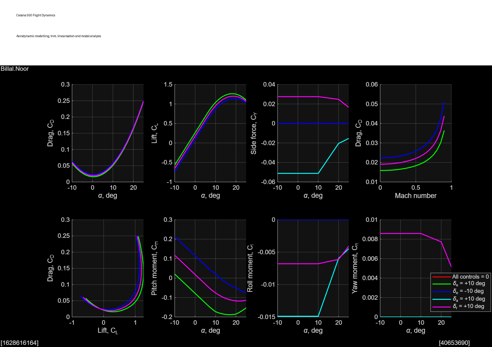

MATLAB based nonlinear flight dynamics project for a Cessna 550 business jet. The work covers aerodynamic coefficient modelling, steady straight and level flight trimming, numerical linearisation, eigenvalue and mode analysis, transfer functions, time domain simulation and yaw damper evaluation.

## Project highlights

- Implemented force and moment coefficients as functions of angle of attack, sideslip, angular rates and control surface deflections.
- Developed a nonlinear twelve state, six degree of freedom rigid body equations of motion function.
- Evaluated trim from 60 to 180 m/s at an altitude of 4000 m.
- Identified longitudinal and lateral directional modes from the linearised state space system.
- Assessed phugoid, short period, Dutch roll, roll subsidence and spiral behaviour.
- Compared aircraft response in ascending flight and control input cases.
- Investigated a feedback yaw damper using root locus and closed loop response plots.

## Trim results

| Velocity (m/s) | Converged | Pitch angle (deg) | Elevator (deg) | Throttle |
|---:|:---:|---:|---:|---:|
| 60 | Yes | 10.938 | -10.830 | 0.4977 |
| 80 | Yes | 4.419 | -3.480 | 0.4225 |
| 100 | Yes | 1.890 | -0.711 | 0.5319 |
| 120 | Yes | 0.555 | 0.682 | 0.7431 |
| 140 | Yes | -0.210 | 1.450 | 0.9883 |
| 160 | No | - | - | - |
| 180 | No | - | - | - |

The successful solutions show decreasing pitch angle as speed rises. Elevator demand changes from negative to positive, while throttle approaches its upper limit by 140 m/s. The failed 160 and 180 m/s cases indicate that the optimiser could not find equilibrium under the available model and actuator constraints.

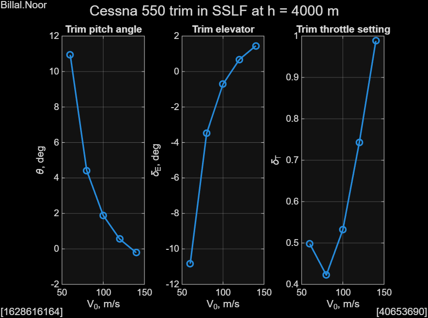

## Aerodynamic model

`C550aero.m` returns the nondimensional aerodynamic force and moment coefficients:

```matlab
F = [CD; CY; CL];
M = [Cl; Cm; Cn];
```

The model includes:

- Compressibility correction through Mach number
- Nonlinear post 6 degree angle of attack terms
- Reduced control effectiveness at high angle of attack
- Elevator, aileron and rudder effects
- Pitch , roll  and yaw rate derivatives
- Angle of attack rate contribution

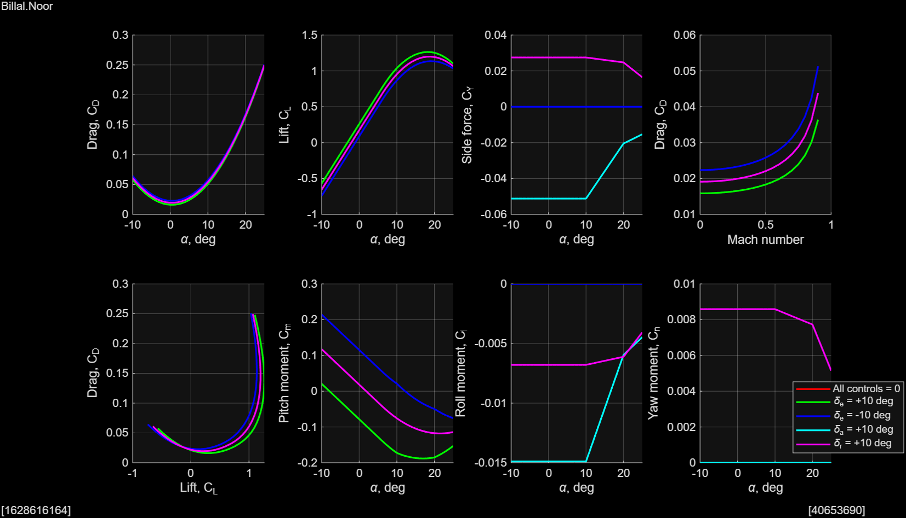

## Nonlinear equations of motion

`EoM12.m` uses the state vector:

```text
[u v w p q r phi theta psi xe ye ze]'
```

and the control vector:

```text
[elevator aileron rudder throttle]'
```

It calculates atmospheric conditions, dynamic pressure, aerodynamic and propulsion loads, rigid body translational and rotational acceleration, Euler angle rates and Earth axis position rates.

## Modal analysis

The numerical linearisation was separated into longitudinal and lateral directional subsystems:

- **Short period mode:** fast longitudinal pitch response
- **Phugoid mode:** slow exchange between speed and altitude
- **Dutch roll mode:** oscillatory yaw roll response
- **Roll subsidence mode:** fast, non oscillatory roll decay
- **Spiral mode:** slow lateral directional divergence or convergence

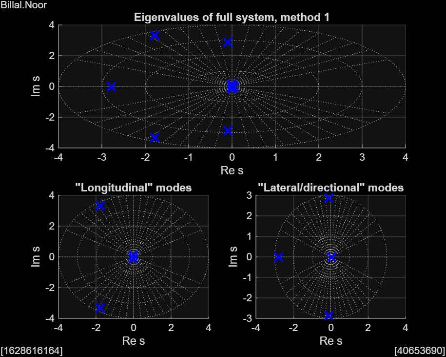

## Simulation results

### Ascending flight response

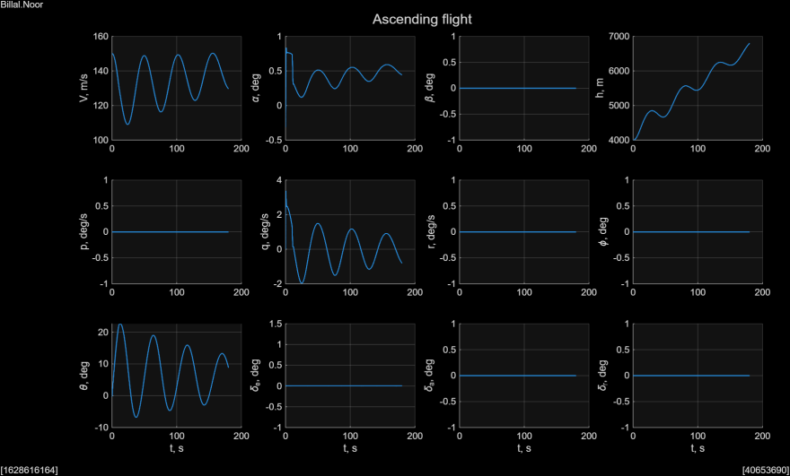

### Phugoid response

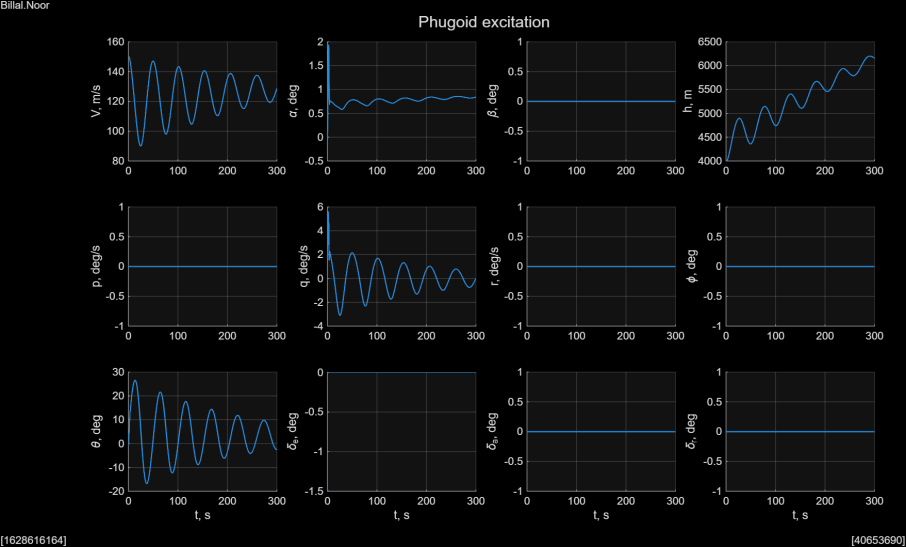

### Lateral directional modes

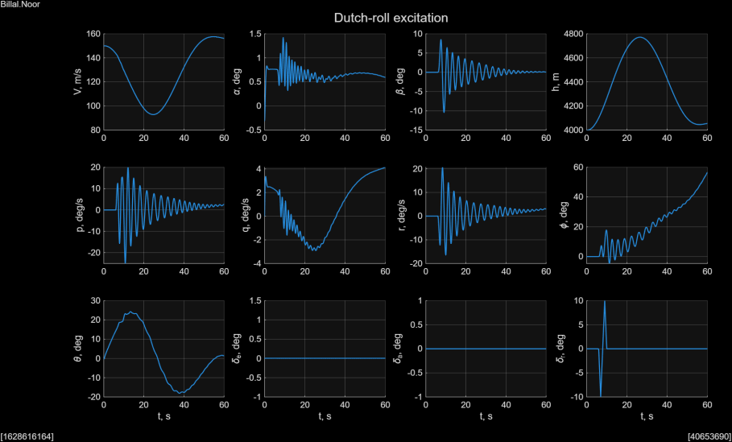

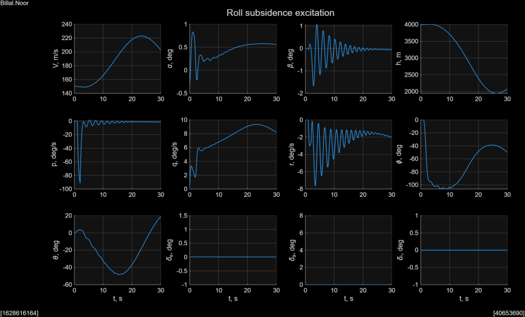

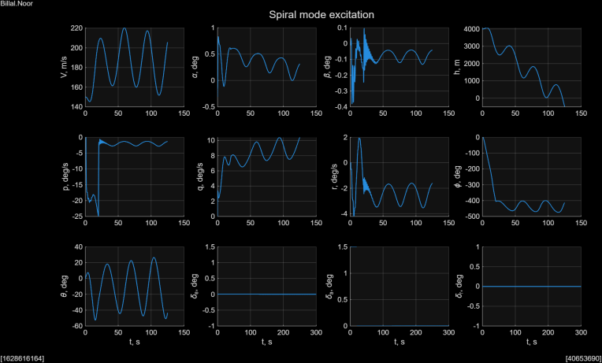

### Yaw damper

A yaw damper was evaluated using rudder feedback from yaw rate. The feedback aims to increase Dutch roll damping while preserving acceptable handling qualities.

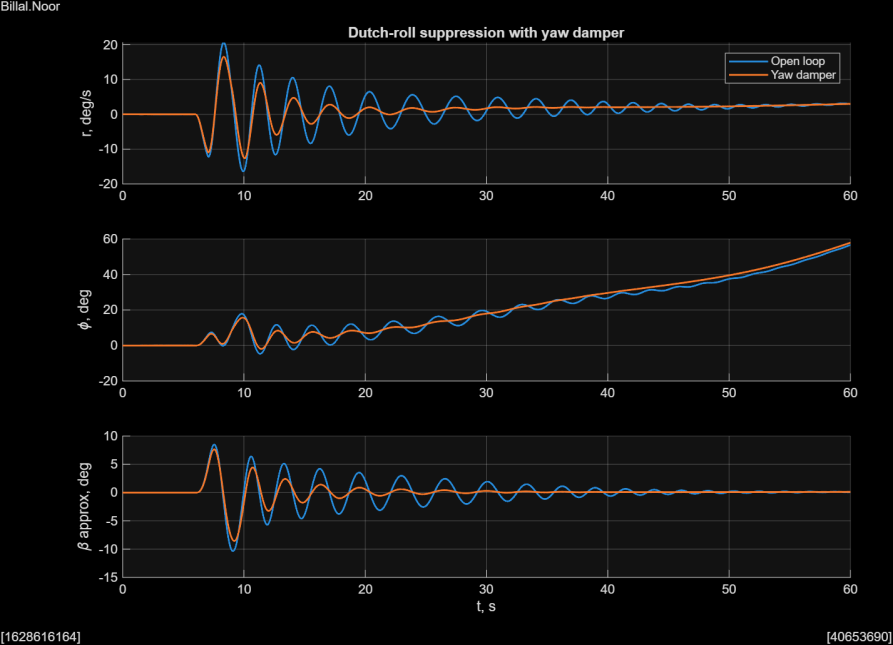

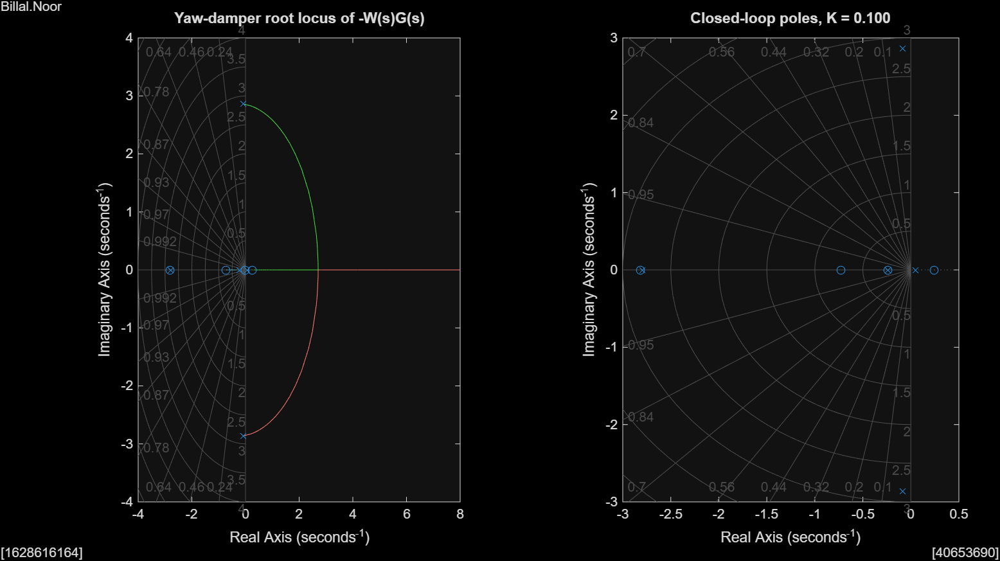


## MATLAB files

| File | Purpose |
|---|---|
| `C550init.m` | Initialises geometry, inertia, engine installation and aerodynamic derivatives |
| `C550aero.m` | Calculates aerodynamic force and moment coefficients |
| `EoM12.m` | Evaluates the nonlinear twelve state rigid body equations of motion |


## Author

**Muhammed Billal Noor**  
Aeronautical Engineering student  
Email: billytoothpunch@gmail.com  
LinkedIn: <https://www.linkedin.com/in/billalnoor/>
