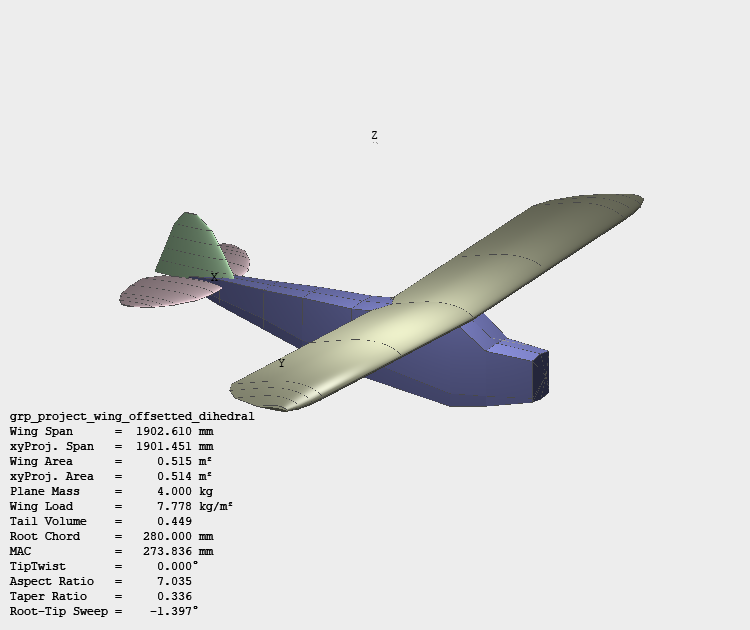
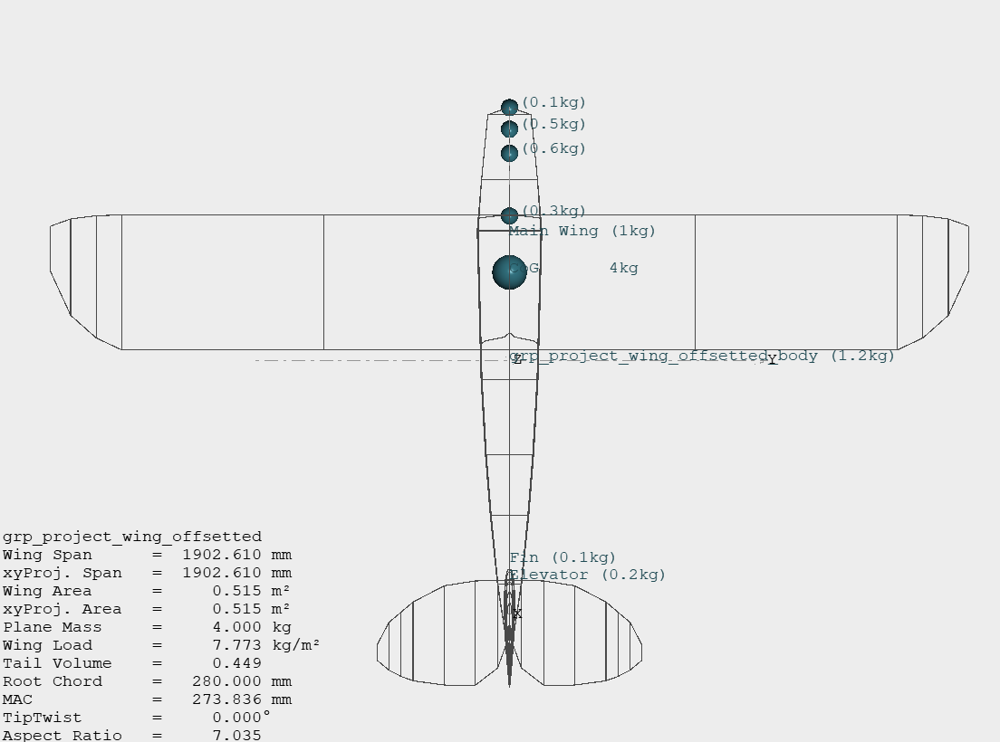
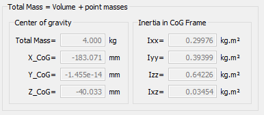
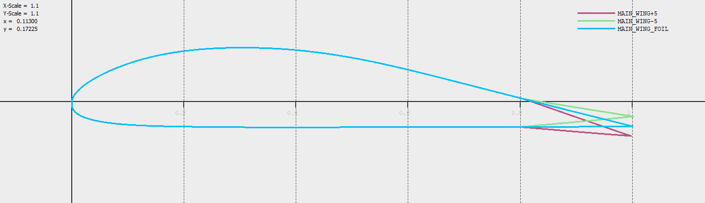
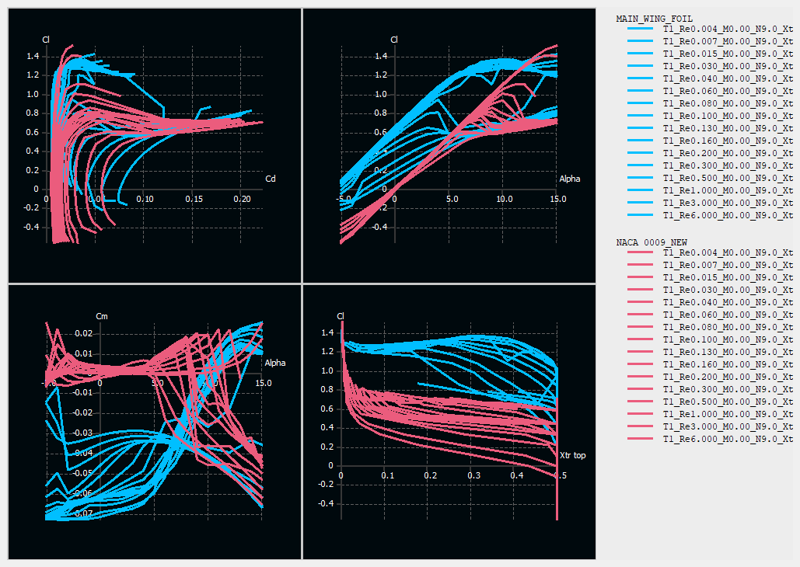
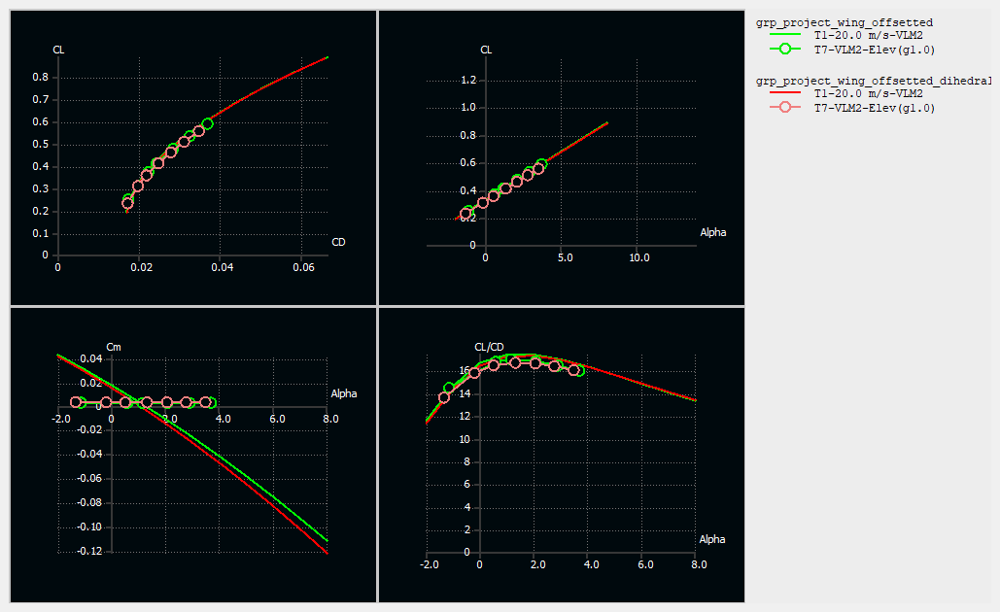
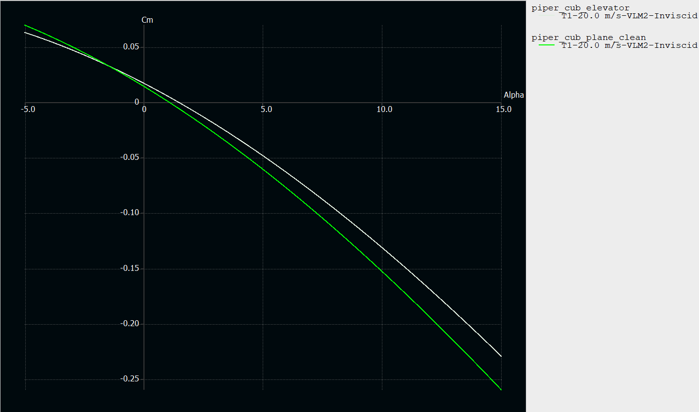
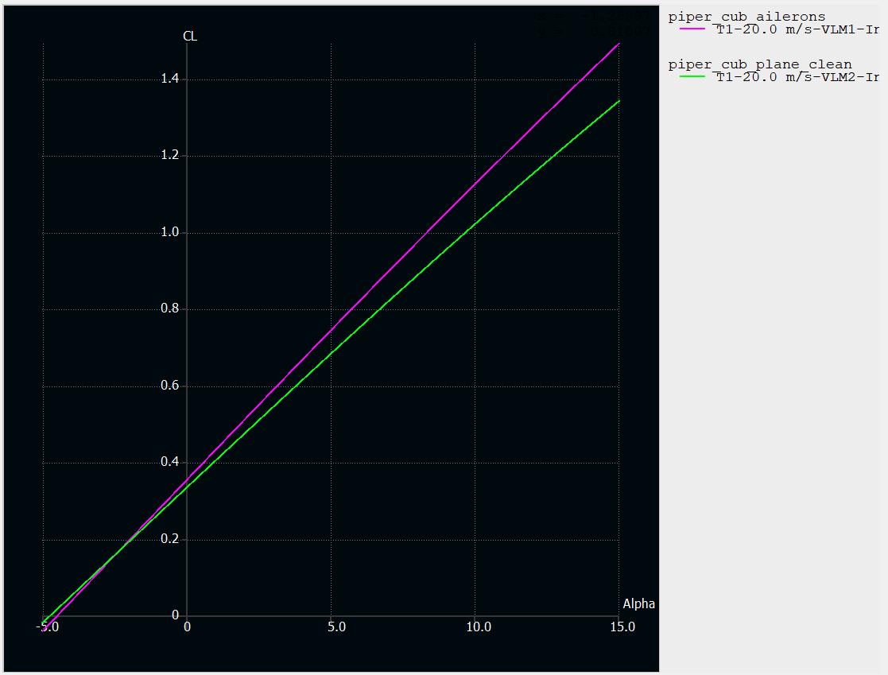
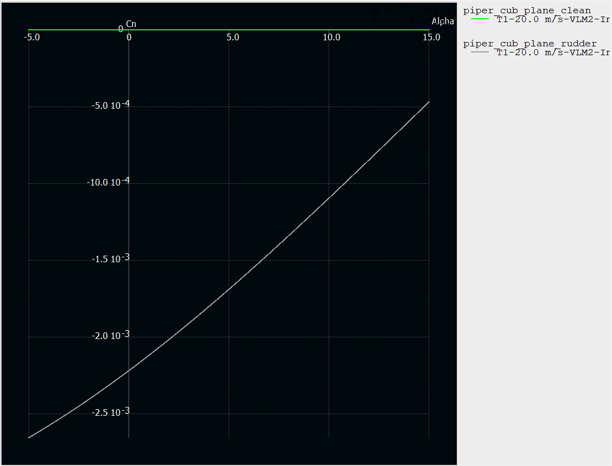

# Piper Cub 40 — XFLR5 Aerodynamic Analysis

**Aircraft modelling, aerodynamic analysis, stability assessment, control-surface evaluation, and MATLAB structural-mass estimation.**

**Author:** Billal Noor  
**Tools:** XFLR5 · MATLAB · Aircraft aerodynamics · Stability and control

> This README provides a visual overview of the work before the project files are opened or run.

---

## Project overview

This personal engineering project recreates a Piper Cub 40 (oz13332) model aircraft in XFLR5 and evaluates its aerodynamic behaviour. The work includes aircraft geometry modelling, airfoil comparison, mass and inertia definition, aerodynamic performance studies, stability comparisons, control-surface analysis, and an accompanying MATLAB mass-estimation script.

<p align="center">
  
</p>

### What the project demonstrates

- Aircraft geometry development in XFLR5
- Airfoil geometry and batch-polar comparison
- Aircraft mass and inertia modelling
- Lift, drag, pitching-moment, rolling-moment, and yawing-moment analysis
- Dihedral and non-dihedral aerodynamic comparison
- Elevator, aileron, and rudder effectiveness studies
- MATLAB-based rib, spar, structural-mass, and centre-of-gravity estimation

---

## XFLR5 model and mass setup

The aircraft geometry was reconstructed in XFLR5 using dimensions taken from the Piper Cub 40 plan. Component masses were then assigned to approximate the aircraft's mass distribution and inertia characteristics.

<p align="center">
  
</p>

<p align="center">
  
</p>

---

## Airfoil analysis

The airfoil geometry and aerodynamic polars were compared across a range of operating conditions. This supports assessment of lift generation, drag, efficiency, and stall behaviour.

<p align="center">
  
</p>

<p align="center">
  
</p>

---

## Aircraft aerodynamic comparison

The complete aircraft was analysed with and without wing dihedral to compare aerodynamic behaviour and identify changes in lift, drag, efficiency, and pitching characteristics.

<p align="center">
  
</p>

---

## Control-surface analysis

### Elevator — pitching response

The elevator study compares pitching-moment behaviour between the clean aircraft and the deflected-elevator configuration, showing how elevator input changes longitudinal control response.

<p align="center">
  
</p>

### Ailerons — lift and rolling-control response

The aileron study examines the aerodynamic change produced by aileron deflection and its influence across the analysed angle-of-attack range.

<p align="center">
  
</p>

### Rudder — yawing response

The rudder study compares yawing-moment behaviour between the clean and rudder-deflected configurations to assess directional-control authority.

<p align="center">
  
</p>

---

## MATLAB structural-mass estimator

The MATLAB script uses airfoil coordinates exported from XFLR5 to estimate:

- Airfoil cross-sectional area
- Rib masses at different chord lengths
- Rib-system centre of gravity
- Spar mass
- Approximate wing, stabiliser, fin, and fuselage structural masses

The script resolves the XFLR5 data file relative to the repository structure, rather than relying on MATLAB's current working directory.

### Run the script

1. Clone or download this repository.
2. Add any additional XFLR5 files to the `xflr5/` folder without renaming them.
3. Open MATLAB.
4. Run:

```matlab
run('matlab/mass_of_airframe_calculation_skript(1).m')
```

The included script currently references:

```text
xflr5/R3_GRP_PROJECT(1).dat
```

Keep that filename unchanged unless the corresponding path inside the MATLAB script is deliberately updated.

---

## Repository structure

```text
piper-cub-xflr5-analysis/
├── README.md
├── LICENSE
├── CITATION.cff
├── PROJECT_NOTES.md
├── figures/                 # Images extracted from the project report
├── matlab/                  # MATLAB structural-mass calculation
├── report/                  # Full rewritten project report
└── xflr5/                   # XFLR5 data and additional files
```

Additional `.xfl`, `.dat`, polar, and analysis files can be placed in `xflr5/` while retaining their original filenames.

---

## Full report

The detailed report is available at:

[`report/Piper_Cub_40_XFLR5_Report.docx`](report/Piper_Cub_40_XFLR5_Report.docx)

It contains the project background, aircraft specifications, modelling method, mass assumptions, aerodynamic interpretation, control-surface analysis, conclusions, and references.

---

## Scope and limitations

The results are engineering estimates based on the geometry, mass assumptions, material properties, and XFLR5 configurations documented in the report. Construction or flight decisions should also use measured component masses, verified geometry, appropriate safety factors, and physical testing.

## Author

**Billal Noor**

## Copyright

Copyright © 2026 Billal Noor. All rights reserved. See [`LICENSE`](LICENSE).
